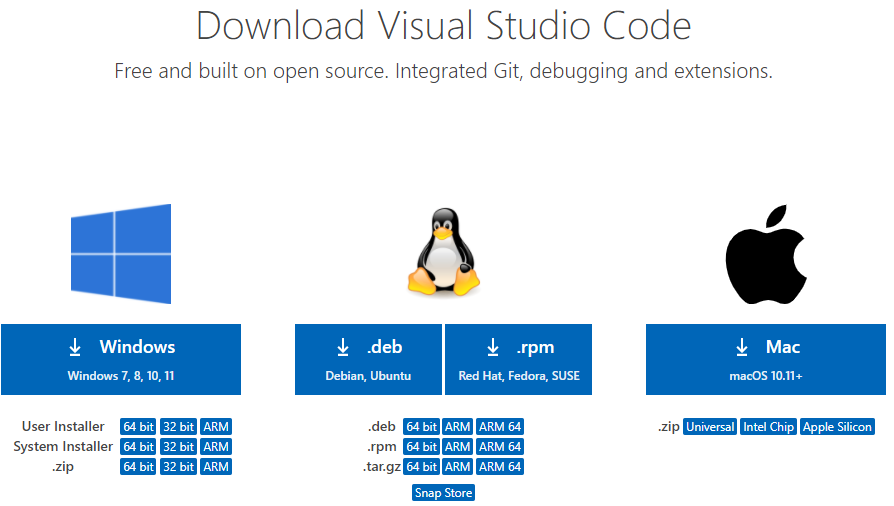
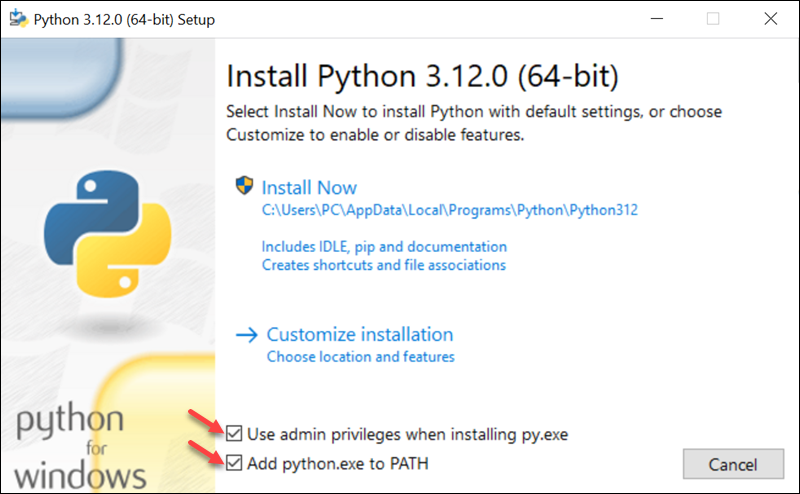

# Dev_Setup

Setup Development Environment

# Assignment: Setting Up Your Developer Environment

# Objective

This assignment aims to familiarize you with the tools and configurations necessary to set up an efficient developer environment for software engineering projects. Completing this assignment will give you the skills required to set up a robust and productive workspace conducive to coding, debugging, version control, and collaboration.

# Tasks

**1. Select Your Operating System (OS):**
   **Choose an operating system that best suits your preferences and project requirements. Download and Install Windows 11.<https://www.microsoft.com/software-download/windows11>**

   1.Check System Requirements

   Before downloading Windows 11, ensure your system meets the following requirements
   :
      - Processor: 1 GHz or faster with 2 or more cores on a compatible 64-bit processor.
      - RAM: 4 GB or more.
      - Storage: 64 GB or more.
      - System firmware: UEFI, Secure Boot capable.
      - TPM: Trusted Platform Module (TPM) version 2.0.
      - Graphics card: DirectX 12 compatible graphics / WDDM 2.x.
      - Display: >9” with HD Resolution (720p).
      - Internet connection: Internet connectivity is necessary to perform updates and to download and take advantage of some features.
  
   2.Backup Your Data

   Before starting the installation, back up all important data to avoid any data loss during the installation process.

   3.Download Windows 11

   1. Open your web browser and navigate to the Microsoft Windows 11 download page.
   2. Under the "Download Windows 11 Disk Image (ISO)" section, select "Windows 11" and click on "Download".
   3. Choose your preferred language and click on "Confirm".
   4. Select "64-bit Download" to download the ISO file.
   
   5. Create a Bootable USB Drive
   6. Download and install the Windows USB/DVD Download Tool.
   7. Open the tool and select the downloaded Windows 11 ISO file.
   8. Choose "USB device" as the media type.
   9. Insert a USB drive (at least 8 GB) into your computer and select it in the tool.
   10. Click on "Begin copying" to create the bootable USB drive.

   4.Install Windows 11

   1. Insert the bootable USB drive into the computer where you want to install Windows 11.
   2. Restart your computer and enter the BIOS/UEFI settings (usually by pressing `F2`, `F12`, `Delete`, or `Esc` key during boot).
   3. Set the boot order to boot from the USB drive.
   4. Save the changes and exit the BIOS/UEFI settings. Your computer will restart and boot from the USB drive.
   

   6.Windows 11 Setup Process

   1. When prompted, press any key to boot from the USB drive.
   2. Select your language, time, and keyboard preferences and click "Next".
   3. Click "Install Now".
   4. Enter your product key if prompted (you can skip this step if you don't have it right now).
   5. Accept the license terms and click "Next".
   6. Choose "Custom: Install Windows only (advanced)".
   7. Select the drive where you want to install Windows 11 and click "Next". The installation process will start.

   7.Post-Installation Setup

   1. After the installation is complete, your computer will restart.
   2. Follow the on-screen instructions to complete the setup process, including setting up your user account, password, and preferences.
   3. Connect to the internet to activate Windows and check for updates.

   Troubleshooting Tips.
       - If you encounter any issues during installation, ensure your system meets the requirements and that the bootable USB was created correctly.
      - For activation issues, verify that your product key is correct and try activating again.
      - For any driver issues, download the latest drivers from the manufacturer’s website.
  By following these steps, you should be able to successfully download, install, and set up Windows 11 on your computer.
_____

**2.Install a Text Editor or Integrated Development Environment (IDE):**
   **Select and install a text editor or IDE suitable for your programming languages and workflow. Download and Install Visual Studio Code. <https://code.visualstudio.com/Download>**

   Step 1: Download Visual Studio Code
      1. Navigate to the Official Website: 
      - Open your web browser and navigate to the official Visual Studio Code website: <https://code.visualstudio.com/>
      -The website should automatically detect your operating system and offer the appropriate version for download.
      

   Step 2: Install Visual Studio Code
      1. **Open the Installer**:
         - The file name format (`VSCodeUserSetup-x64-(VERSION.).exe`) is typical for VS Code installers.

   Step 2: Install Visual Studio Code
      1. Once the download is complete, open the downloaded installer file (e.g., `VSCodeUserSetup-x64-1.[VERSION]].exe`).
      2. The Visual Studio Code Setup Wizard will open. Click **Next** to continue.
      3. Read and accept the license agreement, then click **Next**.
      
      4. Choose the installation location and click **Next**. The default location is usually fine for most users.
      5. Select the additional tasks you would like the installer to perform. It's generally a good idea to check the options for:
         - Add "Open with Code" action to Windows Explorer file context menu
         - Add "Open with Code" action to Windows Explorer directory context menu
         - Register Code as an editor for supported file types
         - Add to PATH (this allows you to open VS Code from the command line)
      After selecting your preferences, click **Next**.
      
      6. Click **Install** to begin the installation process.
      
      7. Once the installation is complete, click **Finish**. You can choose to launch Visual Studio Code immediately by checking the Launch Visual Studio Code option.
    

   Conclusion

   You've successfully installed Visual Studio Code on your Windows system and configured it for your development needs.

   For more detailed instructions and tips, you can visit the official [Visual Studio Code Documentation (https://code.visualstudio.com/docs).
_____

3.**Set Up Version Control System:
   **Install Git and configure it on your local machine. Create a GitHub account for hosting your repositories. Initialize a Git repository for your project and make your first commit. <https://github.com>**

   1. Install Git on Windows:

      - Visit the official Git website: <https://www.git-scm.com/downloads>
      
      - Download the latest version for Windows (`.exe` installer).
      - follow the windows clicking **Next** until the option to choose folder to save git. the deafault is the usual standard.

   2. Configure Git:
      - Open your Command Prompt (search for "Command Prompt" in the Start menu).
      - Run the following commands, replacing `<your_name>` and `<your_email>` with your actual information. This will also work on through GitBash.
      
      - These commands set your global username and email for Git commits.

      To check for configuration use: git config --global --list
      

   3. Create a GitHub Account (if you don't have one): I already have one but here is aguide to obtaine one:

      - Visit GitHub: [https://github.com/join](https://github.com/join)
      - Click "Sign up" and follow the on-screen instructions to create your free account.

   4. Initialize a Git Repository:

      - Create a new directory using File Explorer where you'll store your project files (e.g., `my_project`).
      - Open your Command Prompt/GitBash and navigate to that directory using the `cd` command:
      

      - Run this command to initialize a new Git repository in that directory:
      **git init**

   5. Make Your First Commit:

      - Create some files for your project (code, text documents, images, etc.).
      - Stage the changes (tell Git to track these files):
      **git add**

      -use **git status** to see the files that are staged and ready to be commited.

      - Commit the changes with a descriptive message (use quotes for spaces):
         

You've successfully installed Git, configured it, created a GitHub account, initialized a Git repository, and made your first commit on Windows.
_____

4.**Install Necessary Programming Languages and Runtimes:**
  **Instal Python from <http://wwww.python.org> programming language required for your project and install their respective compilers, interpreters, or runtimes. Ensure you have the necessary tools to build and execute your code.**

   Step 1: Download Pytho
      1. Open your web browser and go to the official Python website: python.org
      <http://www.python.org>.
      2. Click on the **Downloads** tab.
      
      3. The website will automatically suggest the latest version of Python for your operating system. Click on the **Download Python [version]** button.

   Step 2: Run the Installer
      1. Once the download is complete, open the installer.
      2. You will see a setup window. **Check the box that says "Add Python to PATH"**. This is crucial as it will allow you to run Python from the command line.
      3. Click on **INSTALL NOW**
      

   Step 3: Complete Installation
      1. The installer will begin the installation process. This may take a few minutes.
      2. Once the installation is complete, you will see a screen that says **Setup was successful**. SELECT Disable PATH length which will remove the length allowed. Click on **Close**.
      

   Step 4: Verify Installation
      1. Open a command prompt (Windows).
      2. Type 'python --version' and press Enter. You should see the version of Python you installed.
      3. To further verify, you can also start the Python interpreter by typing 'python' and pressing Enter. You should see the Python interactive shell start.

5.**Install Package Managers:**
   **If applicable, install package managers like pip (Python).**

   1. Pip is included with Python installations from version 3.4 and above.   You can verify its installation by typing pip --version in th CMD.
   2. If Pip is not installed, you can install it manually:
      - Download 'get-pip.py' from <https://bootstrap.pypa.io/get-pip.py.>
      - Open a command prompt and navigate to the directory where you downloaded 'get-pip.py'.
      - Run the following command: python get-pip.py

   3. Install Necessary Packages:
      -To install any Python package, you can use Pip. For example, to install the "requests" library, you would run: pip install requests

   If you need further assistance, refer to the official Python documentation or seek help from the Python community.
_____

6.**Configure a Database (MySQL):**
   **Download and install MySQL database. <https://dev.mysql.com/downloads/windows/installer/5.7.html>**

   1. Download MySQL Installer:
         - Visit the MySQL Community Downloads page: MySQL Community Downloads <https://dev.mysql.com/downloads/windows/installer/>
         
         - Click on the "Download" button for the MySQL Installer for Windows.
         

   2. Run the MySQL Installer:
         - Once the download completes, run the installer (mysql-installer-web-community-(VERSION).exe).

   3. Choosing Setup Type:
         - On the Setup Type screen, choose "Custom" to select specific MySQL products.

   4. Select MySQL Products:
         - In the Product Selection screen, select the following components:
         - MySQL Server (latest version)
         - MySQL Workbench (latest version)
         - MySQL Shell (latest version)
         - Optionally, you can add other components if needed.
         - Click on the "Next" button.

   5. MySQL Server Setup:
         - Installer will check for prerequisites. If any are missing, it will prompt you to install them.
         - Accept the license terms and click "Next".
         - Configure MySQL Server by setting up a root password. Ensure to choose a strong password and remember it.
         - Optionally, configure MySQL to run as a Windows service and set it to start automatically.
         

   6. Installation Progress:
         - Click on "Execute" to begin the installation process. This may take a few minutes to complete.
         

   7. Completing the Setup:
         - Once the installation completes successfully, click on the "Next" button.

   8. MySQL Products Configuration:
         - Configure MySQL Workbench settings if prompted.
         - Click on "Next".

   9. Finish Installation:
         - Click on "Finish" to complete the installation.

   **To verify that MySQL has been installed correctly:**

   1. Start MySQL Server:
         - If MySQL was configured as a Windows service, it should start automatically. If not, you can start it manually from the Windows Services console `services.msc`.

   2. Access MySQL Server using MySQL Workbench:
         - Open MySQL Workbench from the Start Menu.
         - You will be prompted to enter the root password you set during installation. Enter the password and click "OK" to connect to MySQL Server.
         

   3. Executing Commands in MySQL Workbench:
         - Once connected, you can execute MySQL commands, create databases, manage users, and perform other administrative tasks using MySQL Workbench's graphical interface.
         

   You have successfully installed MySQL Server, MySQL Workbench, and MySQL Shell on your Windows system. You can now manage databases graphically with MySQL Workbench and perform command-line operations with MySQL Shell. Enjoy using MySQL for your database needs.
_____
8.**Explore Extensions and Plugins:**
   **Explore available extensions, plugins, and add-ons for your chosen text editor or IDE to enhance functionality, such as syntax highlighting, linting, code formatting, and version control integration.**

   Visual Studio Code (VS Code) is highly customizable and extendable through extensions and plugins. These can significantly enhance its functionality, making it a powerful tool for development. here is a guide on how to to supecharge your VSC.

Step 1: Accessing the Extensions Marketplace

   1. Open Visual Studio Code.
   2. Click on the **Extensions** icon in the Activity Bar on the side of the window or use the keyboard shortcut `Ctrl+Shift+X`.

Step 2: Installing Essential Extensions

   1. **Syntax Highlighting**

      - **Python**:
         - Search for Python by Microsoft.
         - Click **Install**.
         - This extension provides rich support for the Python language, including features such as IntelliSense, linting, debugging, and more.

      - **JavaScript/TypeScript**:
         - Search for ESLint.
         - Click **Install**.
         - ESLint helps in identifying and fixing problems in your JavaScript code.

      - **HTML/CSS**:
         - Search for HTML CSS Support.
         - Click **Install**.
         - This extension enhances the support for HTML and CSS, including CSS class and id attribute completion.

2.**Linting**
      - **ESLint**:
         - As mentioned, ESLint is a powerful tool for identifying and reporting on patterns in JavaScript.
         - Search for ESLint.
         - Click **Install**.
      - **Pylint for Python**:
         - Search for `Python` by Microsoft (if not already installed).
         - Ensure linting is enabled in the settings.

3.**Code Formatting**
      - **Prettier**:
         - Search for Prettier - Code formatter.
         - Click **Install**.
         - Prettier is an opinionated code formatter that supports many languages and integrates with VS Code.
      - **Beautify**:
         - Search for Beautify.
         - Click **Install**.
         - This extension allows you to format your code in various languages, including JavaScript, JSON, CSS, and HTML.

4.**Version Control Integration**
      - **GitLens**:
         - Search for GitLens — Git supercharged.
         - Click **Install**.
         - GitLens enhances the built-in Git capabilities of VS Code. It helps you visualize code authorship, explore changes over time, and gain insights into code.
      - **GitHub**:
         - Search for `GitHub Pull Requests and Issues`.
         - Click **Install**.
         - This extension allows you to manage GitHub pull requests and issues directly from within VS Code.

Step 3: Configuring Extensions

1. **Access Settings**:
      - Click on **File** > **Preferences** > **Settings** or use the keyboard shortcut Ctrl+.

2. **Configure Extensions**:
      - Navigate to the settings of each installed extension to customize their behavior according to your workflow.
      - For example, configure Prettier to format on save, or set up specific ESLint rules.

By installing these extensions, you can significantly enhance the functionality of Visual Studio Code. These tools will help you write cleaner, more efficient code with improved productivity. You can explore more extensions on the VS Code Marketplace <https://marketplace.visualstudio.com/vscode>.
_____
9.Document Your Setup:
    Create a comprehensive document outlining the steps you've taken to set up your developer environment. Include any configurations, customizations, or troubleshooting steps encountered during the process.
_____

# Deliverables

- Document detailing the setup process with step-by-step instructions and screenshots where necessary.
- A GitHub repository containing a sample project initialized with Git and any necessary configuration files (e.g., .gitignore).
**<https://github.com/OfentseRabuthu/plpProject>**
- **A reflection on the challenges faced during setup and strategies employed to overcome them.**

(Git always seems to make me think and also learn to memorise,know the git commands and how to troubleshoot with the knowledge i have. Sometimes my knowledge falls short of the problem solution so that is when i use Chatgpt by copying the error message and that usually helps. the honest truth is most of these downloading to install programs are easy to follow and it helps that i already had some of them already installed. The challenge is learning the python language to a pro level. but i am not imapatient and know it ill come with experience )

# Submission

Submit your document and GitHub repository link through the designated platform or email to the instructor by the specified deadline.

# Evaluation Criteria:**

- Completeness and accuracy of setup documentation.
- Effectiveness of version control implementation.
- Appropriateness of tools selected for the project requirements.
- Clarity of reflection on challenges and solutions encountered.
- Adherence to submission guidelines and deadlines.

Note: Feel free to reach out for clarification or assistance with any aspect of the assignment.
